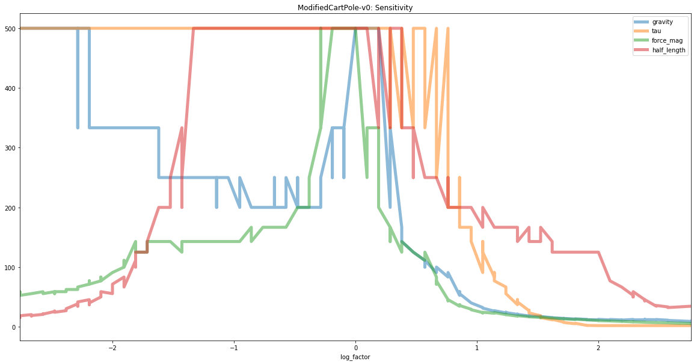

# gym-domain

Reinforcement learning gyms for experimenting with domain generalization, domain adaptation, and robustness to domain shift.

Thanks to [Bill Tubbs](https://twitter.com/biletubes) for inspiration via his https://github.com/billtubbs/gym-CartPole-bt-v0!

#### DomainCartPole-v0

- based on OpenAI's https://github.com/openai/gym/blob/master/gym/envs/classic_control/cartpole.py
- changed to allow physics parameters to be customized on gym creation

Usage:
```
import gym_domain

env1 = gym.make('DomainCartPole-v0', gravity=20.0)
env2 = gym.make('DomainCartPole-v0', half_length=5.0, tau=0.02)

# constructor with all defaults:
env3 = gym.make('DomainCartPole-v0', gravity=9.8, mass_factor=1.0, mass_polecart_ratio=0.1, half_length=0.5, 
        force_mag=10.0, tau = 0.02, max_steps=500):
```

Observations:
- env parameters are appended to observation
```
Type: Box(4)
Num	Observation                 Min         Max

# Original cartpole obs:
0	Cart Position             -4.8            4.8
1	Cart Velocity             -Inf            Inf
2	Pole Angle                -24 deg         24 deg
3	Pole Velocity At Tip      -Inf            Inf

# Added for gym-domain
4	gravity                   -Inf            Inf
5	mass_factor               -Inf            Inf
6	mass_polecart_ratio       -Inf            Inf
7	length                    -Inf            Inf
8 force_mag                 -Inf            Inf

```

##### Results
- trained policy on standard parameter settings using PPO2
- tested performance on domain sweeps of a single parameter at a time


